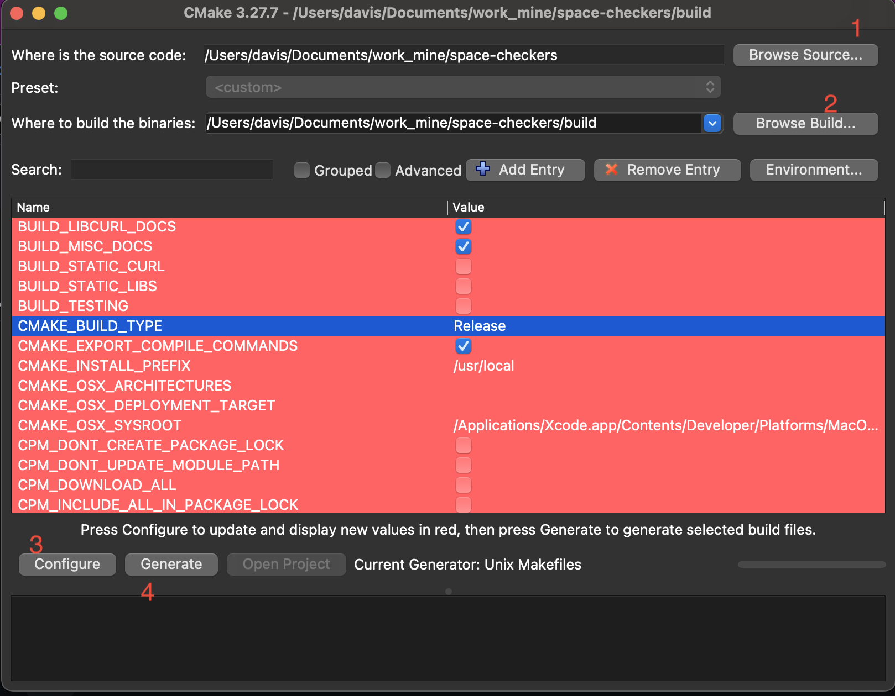

# Building Locally

## On Windows

1. Just open this project folder in Visual Studio 2019 (or newer), with CMake extension installed.
2. From top toolbar, change mode to **Release**, and click **Build** > **Build All**.
3. Done. That's it. Your game .EXE will be in `{project_dir}/out/Release/bin`
4. If the game fails to start, make sure `openal32.dll` is present in **same folder** with your .EXE. If not, copy it from SFML directory `${SFML_HOME}/bin/openal32.dll`

## On MacOS & Linux

1. Open this project directory in your terminal.
2. Ensure CMake 3.20 or higher is installed. Verify with `cmake --version`
3. Once installed, run the following commands:

```bash
mkdir build
cd build
cmake . . -DCMAKE_BUILD_TYPE=Release
cmake --build . --config Release --target all

```

4. Your executable (`.app` bundle for MacOS) and binary for Linux will be found in `{project_dir}/build/bin`

## Using CMake GUI (all destkop platforms)

- Download CMake GUI installer for your OS from the official site. (supported on all desktop OS)
- On MacOS, after installing the GUI, add Cmake CLI to path, run the following command:
  ```bash
   sudo "/Applications/CMake.app/Contents/bin/cmake-gui" --install
  ```
- Refer to the screenshot below:


- Set "Source Folder" (1) to this project root. Then set "Build Folder" (2) to a NEW _relative_ folder `/build` or `/out`. See image above. Then (3) click "**Configure**",
- In the next screen, Choose **Unix Makefiles** if on Linux; choose **XCode** if on Mac. Choose **Visual Studio** if on Windows. Then click OK to save. 
- Make sure CMAKE_BUILD_TYPE is **Release**.
- Click Configure once again, then **Generate**.
- Finally, on Windows and MacOS, click **Open Project** for building in respective IDE. On Linux desktop, open build folder, then run `make all` in Terminal. 